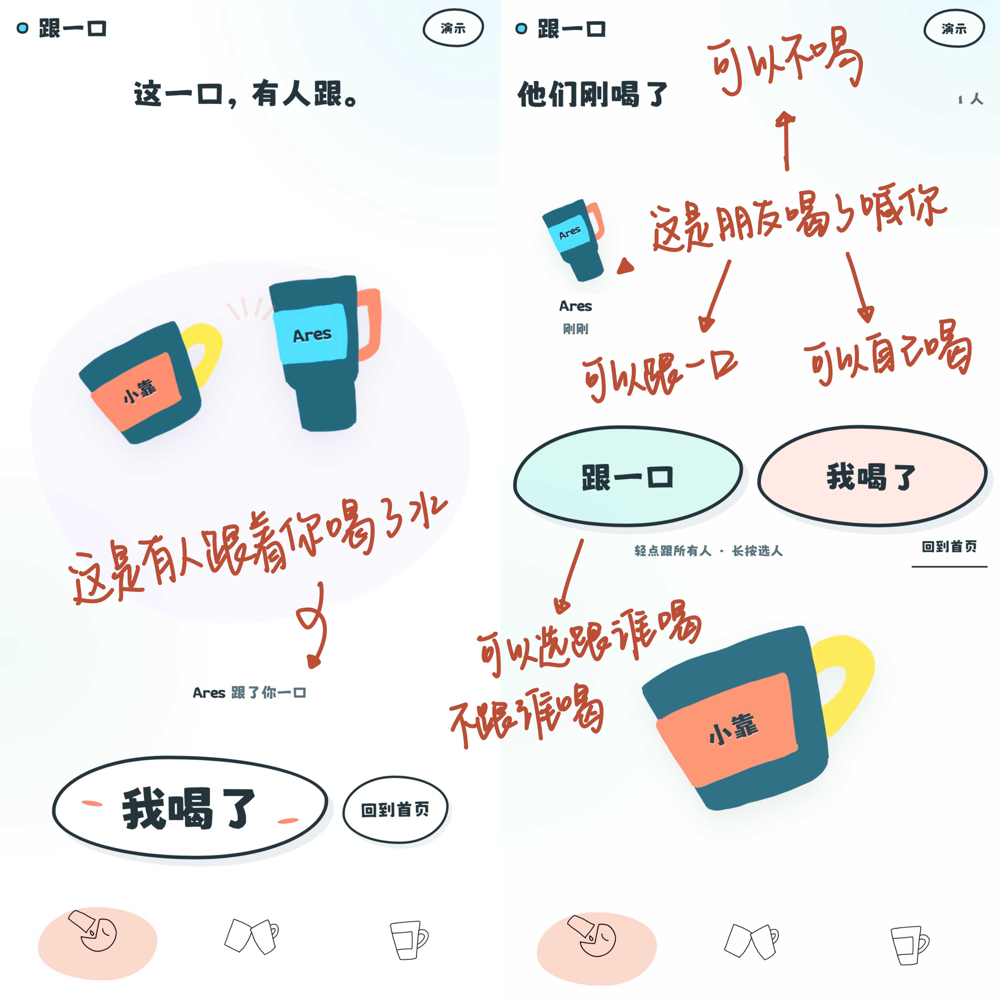
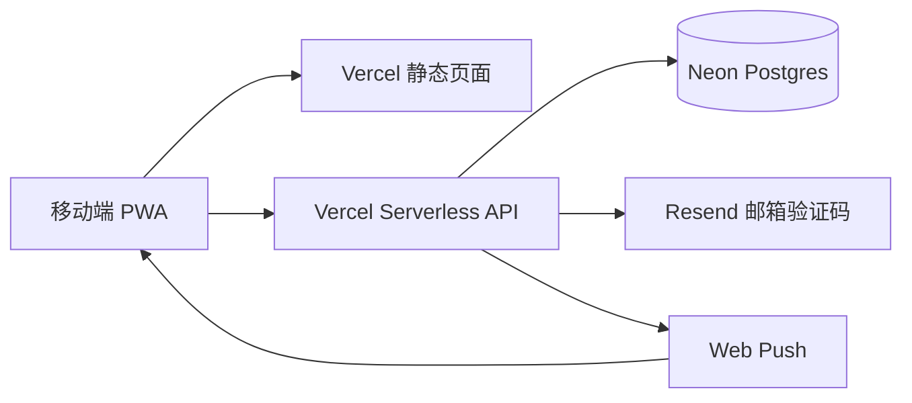

<p align="center">
  
</p>

<h1 align="center">🥤 跟一口 DrinkDrink</h1>

<p align="center"><strong>你喝的时候，喊我一声。</strong></p>

<p align="center">
  一款由朋友的真实喝水行为触发、没有打卡压力的轻社交 PWA。
</p>

<p align="center">
  <a href="https://genyikou.click">在线体验</a> ·
  <a href="https://v.douyin.com/I4HbM1X0cJE/">传播记录</a> ·
  <a href="./docs/跟一口_项目总结与复盘_V1.0.md">项目复盘</a>
</p>

<p align="center">
  <code>PWA</code> <code>Vanilla JavaScript</code> <code>Vercel</code> <code>Neon Postgres</code> <code>Resend</code> <code>Web Push</code>
</p>

<p align="center">
  
</p>

## 为什么做

系统定时提醒很容易被忽略，也容易把喝水变成一项任务。但当一个熟悉的人刚刚喝了水，他的真实行为可能会更自然地带动另一个人。

“跟一口”的体验北极星是：

> 不监督别人喝水，让平静的人被朋友的日常行为轻轻带动一下。

因此，它没有饮水量目标、排行榜、连续签到或未完成警告。产品只保留一个最小社交闭环：

```text
我现实中喝了一口
        ↓
点击「我喝了」
        ↓
朋友看见这次行为
        ↓
朋友自主选择「跟一口」
        ↓
我知道自己的行为带动了朋友
```

项目由个人独立完成产品定义、用户流程、交互视觉、公开运营与数据复盘，并通过 AI 辅助编程完成工程实现。

## 核心体验

### 1. 一只杯子代表一个人

用户可以选择杯型，并分别调整杯身、把手和姓名标签的颜色。杯子不是头像装饰，而是关系页面、喝水提醒和回应动效中的持续身份。

### 2. 「我喝了」发送一次真实行为

点击后会向当前允许接收的关系成员发送喝水信号。信号保留 45 分钟，多条新喝水与新回应按实际时间排队展示。

### 3. 「跟一口」只回应，不制造通知接力

轻点默认回应当前全部信号；长按可以选择这次回应的朋友。“跟一口”不会再生成一轮新的喝水提醒，避免无限接力和回复负担。

### 4. 关系平等，边界可以不同

产品没有群主和管理员。关系级开关作用于整段关系，成员级开关只作用于个人；多人关系新增成员时，需要现有成员共同确认。

## 真实用户验证

数据截至 2026-09-08。产品于 9 月初公开上线，首次抖音传播同期出现了真实用户、真实关系和真实运行压力。

| 指标 | 结果 |
| --- | ---: |
| 抖音单条内容播放 | 10.66 万 |
| 分享 / 点赞 / 收藏 / 评论 | 1,981 / 1,382 / 292 / 209 |
| 累计注册用户 | 561 |
| 完成杯子身份设置 | 515（91.8%） |
| 进入至少一段有效关系 | 325（57.9%） |
| 点击过「我喝了」的用户 | 294 |
| 喝水事件 | 1,731 |
| 重复发起喝水的用户 | 252（发起者的 85.7%） |
| 喝水触达目标 / 回应 | 3,001 / 1,296 |
| 按触达目标计算的回应率 | 43.2% |
| 回应时间中位数 | 1.7 分钟 |
| 5 分钟内完成的回应 | 66.8% |

分享量是点赞量的约 1.43 倍。评论中大量出现 @朋友、询问如何使用和希望一起喝水的表达，说明这套机制具有明显的熟人传播特征。

抖音播放增长与 9 月 7 日单日新增 517 名注册用户高度同期，但上线时尚未接入网站来源分析。因此这里只陈述同期关系，不把全部注册严格归因于抖音，也不计算不可靠的播放到注册转化率。

## 真实反馈如何推动迭代

公开传播不只是带来数字，也快速暴露了原型阶段无法发现的问题：

| 用户反馈与现象 | 后续处理 |
| --- | --- |
| 部分网络无法稳定打开页面 | 接入独立域名，持续评估国内访问与托管方案 |
| 邮件验证码达到免费额度上限 | 补充容量预警、错误反馈与邮件服务升级方案 |
| Android 安装入口表现不一致 | 改为调用浏览器安装能力，并在不支持时展示真实操作步骤 |
| iPhone 安装后重新登录、字体或安全区异常 | 调整 Cookie、独立显示模式、字体本地化和移动端视口 |
| 页面轮询导致状态回弹或闪白 | 改为数据变化时更新，并让结果页由用户主动退出 |
| 长按选择对象时出现错误回应 | 前端与服务端同时校验本次回应目标 |
| 用户希望记录次数和毫升数 | 暂不直接加入，继续验证“轻量社交”与“量化管理”的产品边界 |

评论原始导出包含用户标识与地区信息，只用于本地聚合分析，不提交到公开仓库。

## 当前功能

- 邮箱验证码注册与登录，安全 Cookie 保持会话
- 六种杯子身份与多部位配色
- 创建关系、邀请码加入和备注管理
- 双人及多人关系
- 新成员全员确认与一次性邀请码
- 关系级和成员级接收／发送控制
- 「我喝了」、默认回应全部和长按选择性回应
- 新喝水与新回应按时间排队展示
- Web Push 系统通知和设备级订阅
- Android / iOS 添加到主屏幕
- 账户资料、关系和互动状态云端同步

当前有意不提供饮水量、排名、连续签到、未回应名单和消息历史。

## 系统结构



| 层级 | 实现 |
| --- | --- |
| 客户端 | 原生 HTML、CSS、JavaScript，移动端优先 |
| 安装能力 | Web App Manifest、Service Worker、独立显示模式 |
| 服务端 | Node.js、Vercel Serverless Functions |
| 数据库 | Neon Postgres |
| 身份验证 | Resend 邮箱验证码、签名令牌、HttpOnly Cookie |
| 系统通知 | Web Push、VAPID、设备级订阅 |
| 部署 | GitHub、Vercel、自定义域名 `genyikou.click` |

## AI-native Build

这不是一次“输入一句 Prompt，等待 AI 生成产品”的实验，而是一套由人持续定义问题、作出取舍并验收结果，AI 加速实现与验证的协作流程：

```text
真实问题与产品原则
        ↓
规则、状态与用户流程
        ↓
可操作原型
        ↓
AI 辅助实现与重构
        ↓
自动化测试 + 多设备验收
        ↓
公开部署
        ↓
用户反馈与行为数据
        ↓
下一轮产品决策
```

- 人负责：问题定义、产品边界、交互判断、视觉资产、发布节奏和最终验收。
- AI 协助：把自然语言规则转成代码和测试，定位跨端问题，整理文档并辅助聚合分析。
- 关键原则：对反复出现的问题补测试；对容易歧义的需求先写清状态与优先级；用真实用户反馈校正原型假设。

从「我喝了」与「跟一口」的语义拆分，到消息按时间排队、选择性回应双端校验和 PWA 跨设备适配，项目经历了多轮“规则—实现—验证—复盘”。完整过程见 [AI 协作开发记录](./docs/ai-build-process.md)。

## 项目结构

```text
drinkdrink/
├── api/                 # Vercel API、登录、数据库与推送
├── assets/              # 运行时杯子、图标和本地字体
├── docs/                # 产品规则、用户流程与项目复盘
├── tests/               # 核心业务与部署测试
├── tools/               # 构建和文档辅助脚本
├── client.js            # 前端交互与状态管理
├── styles.css           # 响应式界面与动效
├── index.html           # 页面入口
├── sw.js                # PWA 缓存与推送
├── server.mjs           # 本地开发服务
└── vercel.json          # 生产部署配置
```

## 本地运行

需要 Node.js 18 或更新版本。

```powershell
npm install
npm start
```

然后访问：

```text
http://127.0.0.1:4173
```

未配置 Resend 时，本地开发环境会直接显示六位测试验证码。生产环境应使用真实邮件服务，并关闭开发验证码。

## 检查与测试

```powershell
npm run check
```

完整测试需要先保持本地服务运行，再在另一个终端执行：

```powershell
npm test
```

目前的 9 个测试文件覆盖页面渲染、邮箱登录、邀请关系、喝水轮次、选择性回应、杯子编辑、成员设置、数据持久化和 Vercel API。

## 部署到 Vercel

仓库中的 `vercel.json` 会执行 `npm run build`，将静态资源输出到 `dist/`，并把 `/api/*` 交给 Serverless Functions。生产函数与 Neon 数据库均使用新加坡区域。

需要在 Vercel 中配置以下环境变量：

| 变量 | 用途 | 是否保密 |
| --- | --- | --- |
| `AUTH_TOKEN_SECRET` | 登录令牌签名 | 是 |
| `RESEND_API_KEY` | 邮箱验证码发送 | 是 |
| `AUTH_FROM_EMAIL` | 已验证的发件地址 | 否 |
| `AUTH_ALLOW_DEV_CODE` | 封闭开发时显示测试验证码，公开环境应为 `false` | 否 |
| `DATABASE_URL` | Neon Postgres 连接地址 | 是 |
| `VAPID_PUBLIC_KEY` | 浏览器推送公钥 | 否 |
| `VAPID_PRIVATE_KEY` | 浏览器推送私钥 | 是 |
| `VAPID_SUBJECT` | 推送服务联系地址 | 否 |

变量名与占位示例见 [`.env.example`](./.env.example)。不要把真实密钥提交到 GitHub。

## 项目文档

- [项目总结与复盘](./docs/跟一口_项目总结与复盘_V1.0.md)
- [AI 协作开发记录](./docs/ai-build-process.md)
- [系统架构说明](./docs/architecture.md)
- [当前交互与显示逻辑](./docs/当前交互与显示逻辑_V0.2.md)
- [产品蓝图](./docs/mvp-blueprint.md)
- [用户流程导图索引](./docs/流程导图/User%20Flow_V0.1/README_导图索引.md)
- [产品决策记录](./docs/跟一口_产品决策记录_QA_V0.1.docx)
- [页面与状态清单](./docs/跟一口_页面与状态清单_V0.1.docx)

## 当前阶段

项目已经完成从概念、原型、工程实现到公开验证的第一轮闭环。下一阶段优先处理：

1. 提升国内网络环境下的访问稳定性。
2. 建立从传播、访问、注册、建联到核心互动的完整埋点。
3. 优化邀请链路中“创建后仍未连接第二个人”的主要断点。
4. 提高通知开启率，并继续验证通知与回应之间的相关性。
5. 在不破坏低压力体验的前提下验证历史记录等新需求。

## 数据与隐私

README 只展示匿名聚合结果。真实邮箱、邀请码、用户标识、评论用户资料、数据库连接信息和推送凭证均不应进入公开仓库。
