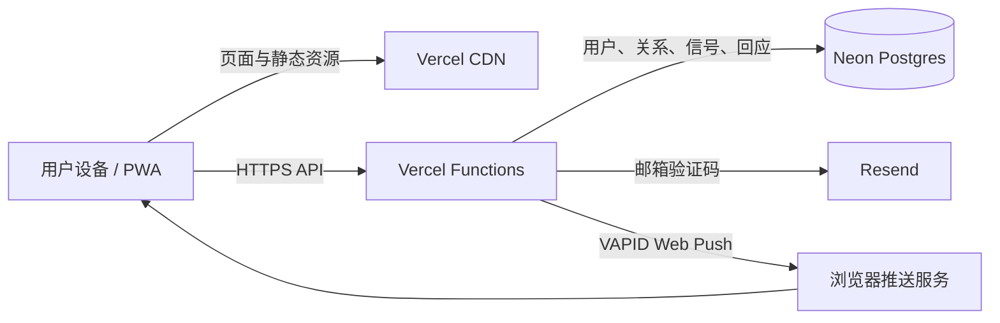

# 跟一口：系统架构说明

## 总览

“跟一口”是一款移动端优先的 PWA。静态页面与 Serverless API 部署在 Vercel，业务数据保存在 Neon Postgres，登录验证码由 Resend 发送，系统通知通过 Web Push 投递。



## 三条核心链路

### 登录

```text
输入邮箱 → API 生成一次性验证码 → Resend 发信
→ 用户提交验证码 → 服务端建立会话 → HttpOnly Cookie 保持登录
```

验证码、会话签名密钥和数据库连接地址只存在于服务端环境变量中，不进入客户端代码或公开仓库。

### 喝水与回应

```text
A 点击「我喝了」
→ 创建喝水事件并写入目标成员
→ B 在应用内看到信号，或收到 Web Push
→ B 点击／长按「跟一口」
→ 服务端校验有效目标并记录回应
→ A 收到回应状态与系统通知
```

未回应信号保留 45 分钟；新喝水与新回应按时间进入展示队列。已读／忽略状态保留在当前设备，核心业务数据保存在云端。

### 多人邀请确认

```text
成员发起邀请 → 生成一次性邀请码 → 候选人申请加入
→ 现有成员分别确认 → 全员同意后建立成员关系
```

关系级设置作用于整段关系，成员级设置只屏蔽指定成员。服务端执行最终权限判断，避免只依赖前端开关。

## 关键工程选择

| 选择 | 原因 | 当前代价 |
| --- | --- | --- |
| 原生 HTML/CSS/JavaScript | 快速验证、小体积、交互可控 | 状态复杂后需要更严格的模块边界 |
| PWA | 一个链接即可体验，并支持安装和推送 | 不同浏览器的安装与推送能力不一致 |
| Vercel Functions | 部署简单、便于快速迭代 | 需要适配无状态运行与区域延迟 |
| Neon Postgres | 关系与互动数据适合关系型模型 | 免费实例休眠与连接管理需要关注 |
| 邮箱验证码 | 早期邀请测试门槛较低 | 邮件额度和送达率会直接影响注册 |
| Web Push | 能在应用外触达用户 | 权限、系统设置和厂商浏览器差异较大 |

## 运行与生产的区别

本地由 `server.mjs` 提供静态页面和兼容 API；生产环境通过 `vercel.json` 构建静态资源，并将 `/api/*` 路由到 Vercel Functions。生产数据只写入 Neon，不依赖 Serverless 实例的临时文件系统。

## 安全与隐私边界

- 认证令牌使用服务端密钥签名，会话通过 HttpOnly Cookie 保存。
- 客户端只包含 VAPID 公钥；私钥保存在 Vercel 环境变量中。
- 公开仓库只保留占位配置，不包含真实邮箱、用户标识、邀请码、数据库导出或评论原始数据。
- README 中的用户数据均为匿名聚合结果。
